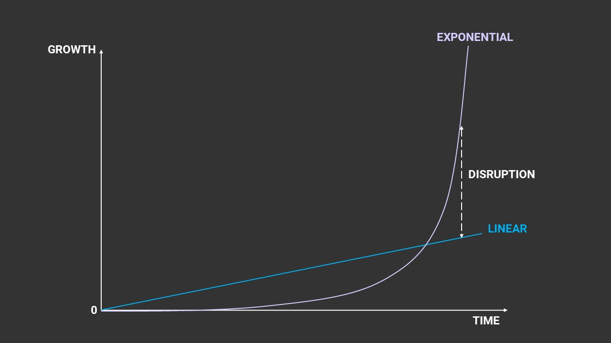
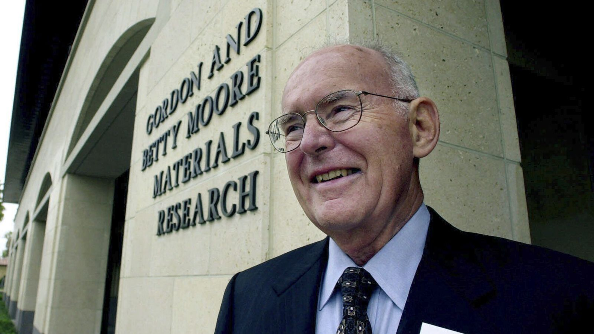
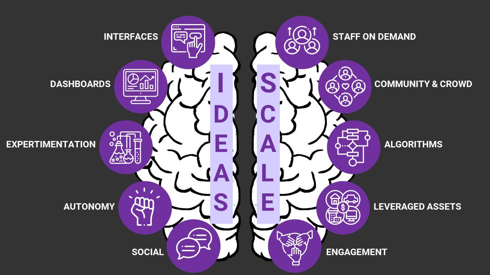
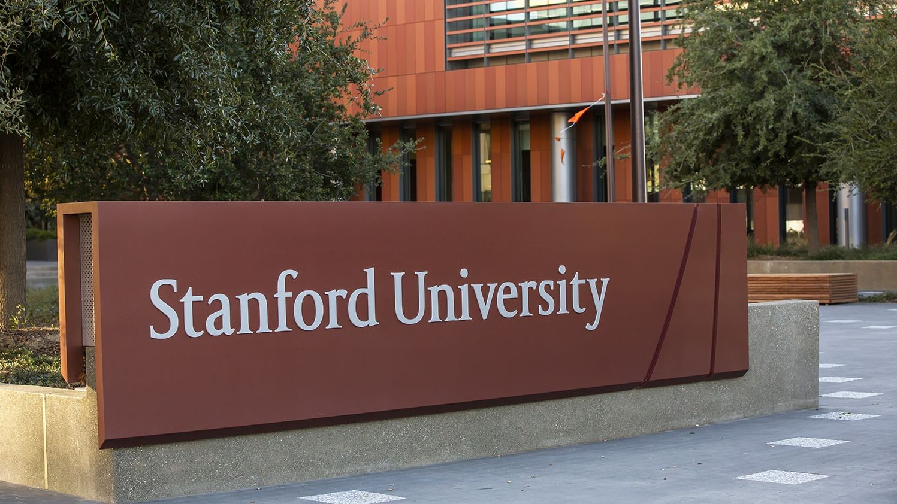
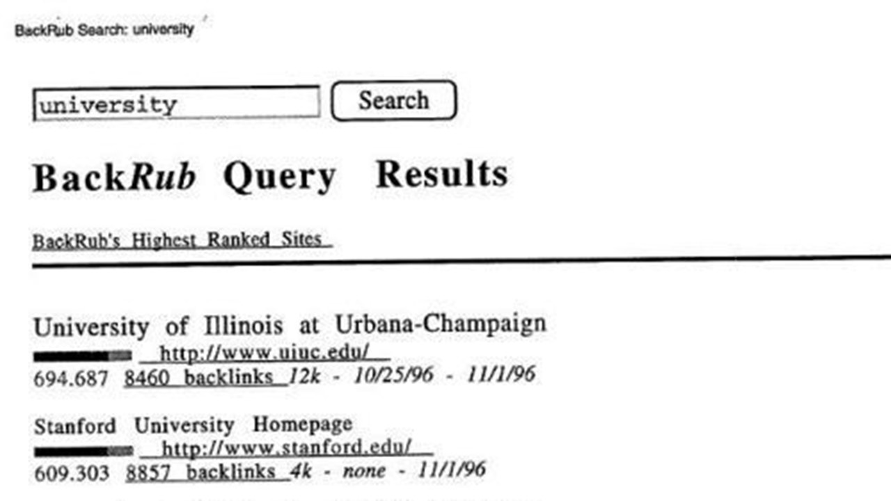
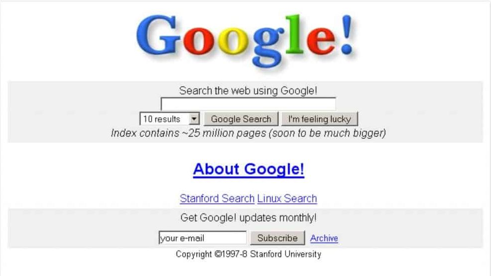
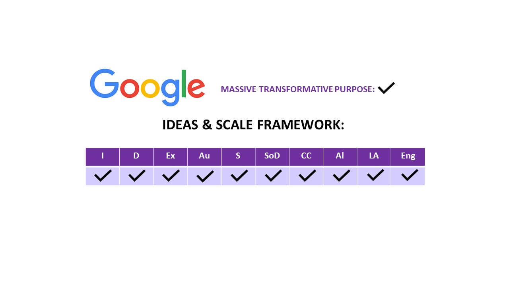

# Google - Exponential organization

## Dalila Yelzhanova 22/11/2023

### Dear Followers and Readers, thank you for joining my blog :)

**Today's topic is an attempt to answer these questions:**
- Why some organizations grow faster than others?
- Why 20th century business models are less successful than 21st century business models?
- Which framework can be used to analyze 21st century technological organizations?
- Why Google is a perfect example for an exponential organization?

---

## What is an Exponential Organization?

**Definintion:** "An Exponential Organization is one whose impact or output is disproportionately large -- at least 10 times larger -- compared to its peers because of new organizational techniques that leverage accelerating technologies." - (link  to the book)

So, the **foundation of building an exponential organization are information technologies**. 

To understand a phenomenon, it is is important to recall to the Moore's Law. Which states that "number of transistors on a microchip doubles every two years" (link to investopedia). 

In fact, here is Moore himself:

_Gordon Moore, the co-founder and former CEO of Intel_

And for explaining how exponential organizations are possible, we need to consider to important tenets of the law, that come from it:

1. We can expect the speed and capability of our computers to increase every two years, yet we will pay less for them. 
2. Growth is exponential. 

Therefore, the most successful companies in 21st century leverage information and technology, rather than increasing human capital or physical assets.

This companies become market leaders by changing dominating business models of the industry through a disruptive innovation. 

Examples include: 
- Google
- Airbnb 
- Uber
- Amazon
- Facebook
- Netflix and etc.

### To be an Exponential Organization company needs to have the following characteristics:

The Massive Transformative Purpose is about thinking big. Radical transformation is its goal.

 

---
## SCALE

### Right Brain:
- Creativity
- Growth 
- Uncertainty
 
**SCALE, a group of five attributes focused on connecting and keeping abundance:**

1. **Staff on Demand:** More part time, specialised, mission based staff.

Depends on a group of pre-screened personnel engaged as required to perform essential operational functions within your primary business. Duties encompass a spectrum from straightforward assignments to intricate tasks, potentially encompassing vital operational procedures.

2. **Community & Crowd:** Harness the power of the community and crowd by engaging with them through whatever means

Communities consist of a vast worldwide assembly of individuals or entities deeply committed to your MTP and actively engaged in your organization's core functions. They exhibit loyalty toward a common objective and are dedicated to addressing the significant challenges associated with your organization's MTP.

On the other hand, the crowd encompasses an even broader global collective, which includes occasional users. These individuals possess a passive interest in your MTP but are not currently directly affiliated with your organization.

3. **Algorithms:** Use data and automate decisions or reduce human biases while making decisions.

The aim is to streamline human tasks, enabling business expansion without a proportional increase in staffing. Algorithms facilitate the complete scaling of products and services, enhancing quality by discovering superior problem-solving approaches through decision support systems. Furthermore, algorithms grant organizations novel capabilities, surpassing what humans alone can achieve. This isn't solely about automation; it's also about venturing into uncharted territory and accomplishing tasks that were previously deemed impossible.

4. **Leveraged Assets:**  Use assets, do not own them unless they are 
scarce

Like the Staff on Demand feature, the Leveraged Assets characteristic provides immediate access to resources as needed, eliminating the necessity for ownership. This, in turn, enables the organization to attain heightened dynamism, flexibility, and rapid growth according to its requirements.

5. **Engagement:** Engage community and 
crowd

Utilizing methods like reputation systems, gamification, loyalty programs, and incentive prizes serves to maintain the engagement, interest, and growing commitment of these groups towards your common objective.

## IDEAS

### Left Brain:
- Order
- Control
- Stability

**IDEAS, a group of five attributes focused on managing abundance to grow:**

1. **Interfaces:** Provide the bridge between external activities and internal control frameworks, e.g. platforms, user interfaces, API’s

The primary concept is to simplify the intricate, whether it pertains to user interaction or interactions between various systems. Concerning users, the user interface (UI) represents the visual aspect of the software application that they observe, while the user experience (UX) pertains to the manner in which they engage with the system. In the case of systems, application programming interfaces (APIs) refer to the code-based connections through which your systems communicate with external (or internal) systems, facilitating the exchange of data and functionality.

2. **Dashboards:** Metrics to measure, real time and meaningful

It furnishes the data necessary for managing business. Exponential Organizations (ExOs) utilize dashboards featuring unconventional metrics like innovation accounting and indicators specifically designed to monitor progress toward the organization's purpose. The emphasis is not on the presentation of data (which is not groundbreaking) but rather on determining the kind of data that should be displayed.

3. **Experimentation:** Lean startup methods of testing assumptions and consistently experimenting with 
controlled risks

The process of confirming assumptions prior to making substantial investments in the organization or new concepts. Every experiment generates a collection of insights that can be applied to enhance products or services.

4. **Autonomy:** New “empowered” or team based organisational forms

Utilizing self-organized, multi-disciplinary teams that function with decentralized authority is key. Autonomy can extend to staff on demand or even users, granting them the independence to operate more autonomously. This, in turn, expands the organization's potential for exponential growth.

5. **Social Technologies:**  Create horizontal interactions in vertical organized businesses

The focus is on enhancing internal operations by fostering social interaction through technology, encompassing communication, collaboration, and workflow, and investigating effective methods to achieve this.

## How is Google almost perfect Exponential Organization?

### "Organize the World's Information" - Mission of Google

1. Select a Massive, Transformative Purpose (or MTP) 

Here is Google’s: “Organize the World’s Information".

2. Join or create relevant communities

Almost everyone are using Google now,both in B2B and in B2C. With more than 3 billion users and a market share of 90%.

When Larry Page and Sergey Brin launched Google (BackRub that time) in 1996. They did it on Stanford University network.

Today Google work with it's community by increasing and strengthening their digital ecosystem, developing best working environment, collaborating with corporate partners and etc.

3. Compose a founding team (optimally four people). We recommend a visionary, UX expert, engineering guru and a business/finance expert.

Again, back to the history of Google, it all started with:
- Stanford Computer Science graduate and a co-founder (Larry Page)
- Stanford  Computer Science Student and a co-founder (Sergey Brin)
- Garage owner and first Marketing Director (Susan Wojcicki - later she became CEO of YouTube)

 And then these people joined:
- Investor (Andy Bechtolstein)
- First CEO (Eric Schnidt)

4. Select a breakthrough idea that delivers a minimum 10x improvement over the status quo. Let’s note that we don’t begin with the core idea — that way you’re not tied to a particular solution, but rather the problem space.

Page and Brin were working on developing a new kind of Search engine, based on the linking behavior on the World Wide Web. They created an algorithm, named after Larry Page to rank the search results based on linking behavior. 

5. Build your Business Model Canvas (see Lean Startup). This simple process generates nine key elements to consider in the business model (including partnerships, channels to market, USP, etc).

Based on the existing problem of Search Engines that time (like Yahoo, Alta Vista and Excite), which were irrelevant search results and difficulties with finding things. Google co-founders were able to develop a technology that would allow users to search and find relevant content faster and effectively. 

Targeting all Web Users in the World, with their innovative algorithm, they had big chances to succeed with that disruptive innovation. 

6. Find your Business Model — basically, how will you make money? Many startups today deliver new business models as a way to compete against legacy companies (Netflix being a prime example).

Being absolutely free of charge for users, their first revenue streams were investments and advertising revenue.

7. Build the Minimum Viable Product (or MVP — again, see Lean Startup). What’s the smallest feature footprint that allows you to get to market and get feedback from users? Note for many successful web products (e.g. Twitter, Foursquare, Facebook), their initial product was quite flaky — the design flawed and the user interaction questionable. But they iterated rapidly with initial customer data and were ultimately successful.

_Google at 1998_

8. Validate marketing & sales channels. Groupon spent 18 months in one city getting the sales and marketing footprint just right. Then they quickly replicated that in dozens of cities.

9. Organize so that core mission-critical functions are occurring outside the core organization (e.g. Uber’s matching of driver and passenger is not handled by its core team).

10. Aim to be a platform. Successful ExOs (Apple, Google, Amazon) are all platforms. Companies that didn’t achieve that (Yahoo, Blackberry, Nokia) ended up in trouble.

## Why is it important to be an Exponential Organization?

“Exponential Organizations should be required for anyone interested in the ways exponential technologies are reinventing best practices in business.” -

_Ray Kurzweil - Director of Engineering, Google_

- "By the End of this Decade Every Organization will be an Exponential Organization." - 

_OpenExo_

For a typical Consumer Packaged Goods(CPG) it will take 250-300 days to move a new product from invention to retail stores' shelves.

For an Exponential Organization in the same industry it will take 29 days.

Founded in 2008 Airbnb currently has:

- 1 324 employees
- 500 000 listings operating 
- 33 000 cities
- owns no physical assets
- worths almost 10 billion $ (2014 data)

### That's bigger than the value of:

Hyatt Hotels 

- 45 000 employees
- 549 properties 

##  Key Takeaways

 1. First Fundamental Driver of Exponential Organizations is that part of the product is information based and therefore follows Moore's Law.

2.  Second Fundamental Driver is that Major Business Functions can be transferred outside of the organization - to users, fans, partners or the general public. 

3. Google is in the World's Top-5 Exponential Organizations (Out of 100 in the ranking)

##  Guess who is #1?

1.  GitHub
2. Airbnb
3. Uber
4. Indiegogo
5.  Google

## References:

- Ismail, Salim, et al. Exponential Organizations Why New Organizations Are Ten Times Better, Faster, and Cheaper than Yours (and What to Do about It). Diversion Books, 2014.
- https://www.wired.com/2015/04/here-are-the-secrets-of-unicorn-companies/#.9qdks31jm
- https://www.entrepreneur.com/growing-a-business/what-is-an-exponential-organization/341439
- https://blog.openexo.com/exo-attributes-the-11-key-elements-to-build-an-exponential-organization
- https://frankdiana.net/2015/04/01/exponential-organizations/
- https://insight.openexo.com/top100-exponential-organizations-who-were-they-and-where-are-they-now/
- https://insight.openexo.com/top100-exponential-organizations-who-were-they-and-where-are-they-now/
- https://web.openexo.com/exo-transformation-guide-download/?submissionGuid=594a8eed-edfe-4bb7-9fa3-21a9992ec441
- https://web.openexo.com/top100-report-download/?submissionGuid=c5f9ca69-0e4b-497a-be51-d93ff0b5e63c
- https://www.theverge.com/2018/9/5/17823490/google-20th-birthday-anniversary-history-milestones
- https://railsware.com/blog/5-lean-canvas-examples/

