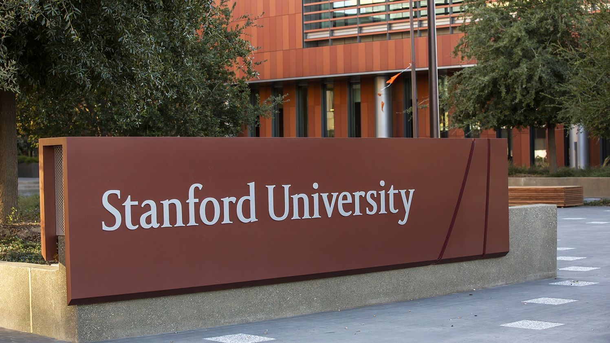
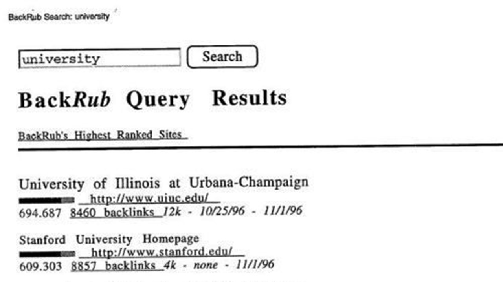
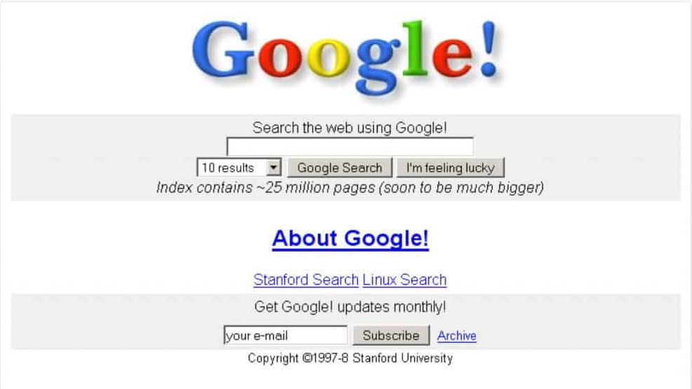
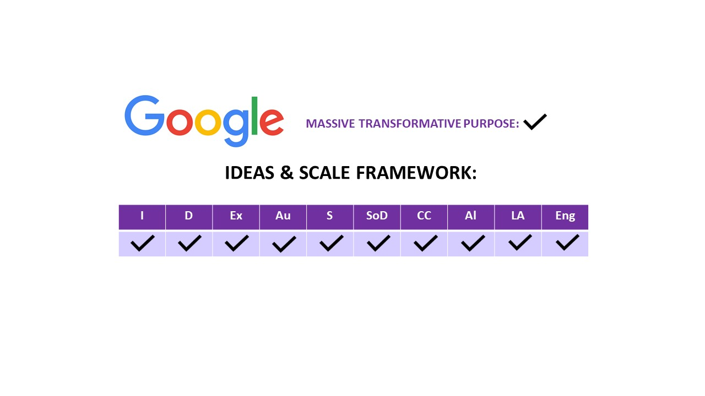

# Google - Exponential organization

## Dalila Yelzhanova 22/11/2023
---

---
- ### Why some organizations grow faster than others?
- ### Which framework can be used to analyze 21st century technological organizations?
- ### Why Google is a perfect example for an exponential organization?
- ### Why do we need to study exponential organizations?
---
## What is an Exponential Organization?

---

### Definition

"An Exponential Organization is one whose impact or output is disproportionately large **at least 10 times larger** compared to its peers because of new organizational techniques that leverage **accelerating technologies**." -

(Salim Ismail, 2014)

---

---

### Gordon Moore, the co-founder and former CEO of Intel
Author of **Moor's Law**

---

---

1. We can expect the speed and capability of our computers to increase every two years, yet we will pay less for them. 

2. Growth is exponential. 

---

The most successful companies in 21st century **leverage information and technology**, rather than increasing human capital or physical assets.

---

### Examples include: 
-  Google
- Airbnb 
- Uber
- Amazon
- Facebook
- Netflix and etc.

---
# How to become an Exponential Organization?

---

---

## 1. Select a Massive, Transformative Purpose (or MTP) 

The Massive Transformative Purpose is about thinking big. Radical transformation is its goal.

---

### Google's MTP: 

“Organize the World’s Information"

---

## 2. Join or create relevant communities

---

---

## 3. Compose a founding team (5 people)

---

- Stanford Computer Science graduate and a co-founder (Larry Page)
- Stanford  Computer Science Student and a co-founder (Sergey Brin)
- Garage owner and first Marketing Director (Susan Wojcicki - later she became CEO of YouTube)

---

## 4. Select a breakthrough idea that delivers a minimum 10x improvement over the status quo. 

---

Page and Brin were working on developing a new kind of Search engine, based on the linking behavior on the World Wide Web. 

(Larry Algorithm) 

---

## 5. Build your Business Model Canvas 

---

Google's secret recipe: technology allowed users to search and find relevant content faster and more effectively.

---

## 6. Find your Business Model

---

Being absolutely free of charge for users, their first revenue streams were investments and advertising revenue.

---

## 7. Build the Minimum Viable Product 

---

---

## 8. Validate marketing & sales channels.

---

---

## 9. Organize so that core mission-critical functions are occurring outside the core organization

---

## Who owns Web Pages?

## Who creates Web Pages?

---

## 10. Aim to be a platform

---

## To be an Exponential Organization company needs to have the following characteristics:

---

---

## IDEAS

### Left Brain:
- Order
- Control
- Stability 

---
## SCALE

### Right Brain:
- Creativity
- Growth 
- Uncertainty 

---

---

# Why is it important to be an Exponential Organization?

---

- "By the End of this Decade Every Organization will be an Exponential Organization." - 

_OpenExo_

---

For a typical Consumer Packaged Goods(CPG) it will take 250-300 days to move a new product from invention to retail stores' shelves.

For an Exponential Organization in the same industry it will take 29 days.

---

Founded in 2008 Airbnb currently has:

- 1 324 employees
- 500 000 listings operating 
- 33 000 cities
- owns no physical assets
- worths almost 10 billion $ (2014 data)

---
### That's bigger than the value of:

Hyatt Hotels 

- 45 000 employees
- 549 properties 

---

##  Key Takeaways

 1. First Fundamental Driver of Exponential Organizations is that part of the product is information based and therefore follows Moore's Law.

2.  Second Fundamental Driver is that Major Business Functions can be transferred outside of the organization - to users, fans, partners or the general public. 

3. Google is in the World's Top-5 Exponential Organizations (Out of 100 in the ranking)

##  Guess who is #1?

---

1.  GitHub
2. Airbnb
3. Uber
4. Indiegogo
5.  Google

---
## References:

- Ismail, Salim, et al. Exponential Organizations Why New Organizations Are Ten Times Better, Faster, and Cheaper than Yours (and What to Do about It). Diversion Books, 2014.
- https://www.wired.com/2015/04/here-are-the-secrets-of-unicorn-companies/#.9qdks31jm
- https://frankdiana.net/2015/04/01/exponential-organizations/
- https://insight.openexo.com/top100-exponential-organizations-who-were-they-and-where-are-they-now/
- https://insight.openexo.com/top100-exponential-organizations-who-were-they-and-where-are-they-now/

---

- https://web.openexo.com/exo-transformation-guide-download/?submissionGuid=594a8eed-edfe-4bb7-9fa3-21a9992ec441
- https://web.openexo.com/top100-report-download/?submissionGuid=c5f9ca69-0e4b-497a-be51-d93ff0b5e63c
- https://www.theverge.com/2018/9/5/17823490/google-20th-birthday-anniversary-history-milestones
- https://railsware.com/blog/5-lean-canvas-examples/

